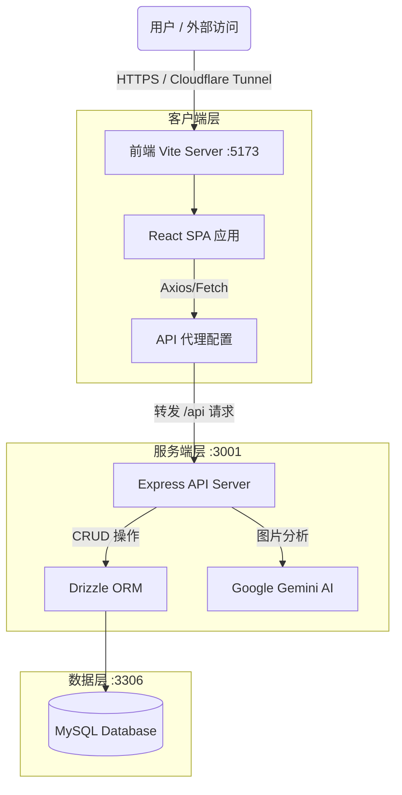

# ExpensePro 💰

**ExpensePro** 是一款现代化的全栈个人记账助手，深度集成 **Google Gemini AI**，让记账变得智能、高效且直观。


---

## ✨ 核心功能

### 🤖 AI 智能记账
告别繁琐的手动输入！只需上传或粘贴消费小票图片，**Google Gemini AI** (支持 2.0 Flash / 3.0 Flash Preview) 即可自动识别：
*   商家名称
*   消费金额
*   消费日期（智能推断年份）
*   消费分类
*   **支持批量识别**：一次性提取多条记录。
*   **图片预览**：点击缩略图可全屏查看小票细节。

### 📊 交互式数据看板
*   **资产概览**：实时掌握总支出、交易笔数及单笔最高消费。
*   **趋势分析**：
    *   **全宽堆积面积图**：直观展示分类支出的时间变化趋势。
    *   **每日明细堆叠图**：精确到每一天的消费结构。
    *   **分类占比饼图**：清晰的支出构成分布。
*   **多维度筛选**：支持按近7天、30天、90天或全部时间段筛选数据。

### 🎨 现代化 UI/UX
*   **自定义组件**：全站统一的圆角悬浮下拉菜单，带颜色标识和流畅动画。
*   **深色模式**：内置 Light/Dark 主题切换，适配所有光照环境。
*   **分类管理**：支持用户自定义添加、删除和排序消费分类，个性化定制专属账本。
*   **响应式设计**：完美适配桌面端与移动端访问。

---

## 🛠️ 技术栈与架构

本项目采用前后端分离的 **全栈 TypeScript** 架构。

### 前端 (Client)
*   **框架**: React 19 + Vite 6
*   **语言**: TypeScript 5.9
*   **图表**: Recharts
*   **样式**: CSS Variables (Deep Dark Theme) + Custom UI Components
*   **图标**: Lucide React

### 后端 (Server)
*   **运行时**: Node.js
*   **框架**: Express.js
*   **数据库**: MySQL 8.0
*   **ORM**: Drizzle ORM (类型安全)
*   **AI SDK**: Google Generative AI (Native REST API)

### 🏗️ 系统架构

本应用在开发模式下通过 Vite 的反向代理整合为一个服务入口，对外只需暴露前端端口。



---

## 🚀 快速开始

### 环境要求
*   Node.js (v18+)
*   MySQL 8.0
*   Docker & Docker Compose (可选)
*   Google Gemini API Key (可从 Google AI Studio 获取)

### 配置步骤

#### 1. 复制环境配置

```bash
cp .env.example .env
```

编辑 `.env` 文件，配置以下内容：

```env
# 数据库配置
DB_PASSWORD=你的数据库密码
DB_NAME=expense_pro

# 应用密钥
JWT_SECRET=你的JWT密钥
# 生成命令: openssl rand -hex 64

# AI 服务配置 (Gemini)
AI_BASE_URL=https://generativelanguage.googleapis.com/v1beta

NODE_ENV=production
```

#### 2. 启动方式

##### 方式一：Docker 部署 (推荐)

```bash
# 构建并启动所有服务
docker-compose up -d --build

# 初始化数据库表
docker exec expensepro-app-1 npx drizzle-kit push

# 查看日志
docker logs -f expensepro-app-1
```

访问 **http://localhost** 即可使用。

##### 方式二：本地开发

```bash
# 安装依赖
cd client && npm install
cd ../server && npm install

# 初始化数据库表
cd server
npx drizzle-kit push

# 启动服务
# 方式1: 双击 start.bat (Windows)
# 方式2: 手动启动
cd server && npm run dev    # 后端 :3001
cd client && npm run dev    # 前端 :5173
```

访问 **http://localhost:5173** 即可使用。

---

## 🐳 Docker 部署说明

### 端口映射

| 服务 | 端口 | 说明 |
|------|------|------|
| 前端 | 80 -> 3001 | 直接访问 http://localhost |
| MySQL | 127.0.0.1:3306 | 本地访问 |

### 常用命令

```bash
# 启动服务
docker-compose up -d

# 停止服务
docker-compose down

# 停止服务并删除数据
docker-compose down -v

# 查看日志
docker logs -f expensepro-app-1

# 重启应用
docker restart expensepro-app-1

# 进入容器
docker exec -it expensepro-app-1 sh
```

### 代理配置

如果需要通过代理访问 AI 服务，编辑 `docker-compose.yml` 中的环境变量：

```yaml
environment:
  - HTTP_PROXY=http://host.docker.internal:7890
  - HTTPS_PROXY=http://host.docker.internal:7890
```

---

## 🌐 Cloudflare Tunnel 分享

如果你想将本地运行的 ExpensePro 分享给朋友使用，可以使用 Cloudflare Tunnel。得益于 Vite 的反向代理，你**只需要暴露前端端口 (5173)**。

确保项目运行中，然后在终端执行：

```bash
cloudflared tunnel --url http://localhost:5173
```

你将获得一个类似 `https://purple-river-12345.trycloudflare.com` 的链接，朋友访问该链接即可正常使用所有功能（包括 AI 记账）。

---

## ⚙️ AI 设置

1.  打开应用，进入 **Dashboard**。
2.  点击 "AI 智能记账" 卡片右上角的 **齿轮图标** ⚙️。
3.  输入您的 **Google Gemini API Key**。
4.  选择偏好的模型（推荐 `gemini-2.0-flash` 以获得最佳速度与准确性平衡）。
5.  设置将自动保存在本地。

---

## 📂 目录结构

```text
ExpensePro/
├── client/                 # React 前端
│   ├── src/
│   │   ├── components/     # UI 组件 (Charts, Forms, CustomSelect...)
│   │   ├── App.tsx         # 主应用逻辑
│   │   └── App.css         # 全局样式
│   └── ...
├── server/                 # Express 后端
│   ├── src/
│   │   ├── db/             # Drizzle Schema
│   │   └── index.ts        # API Endpoints
│   └── ...
├── README.md               # 项目文档
└── start.bat               # 一键启动脚本
```

---
Made with ❤️ by Anchorite
